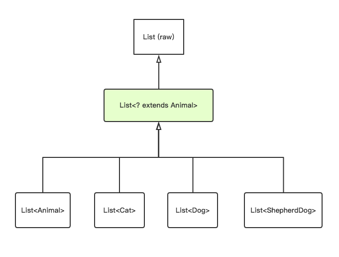
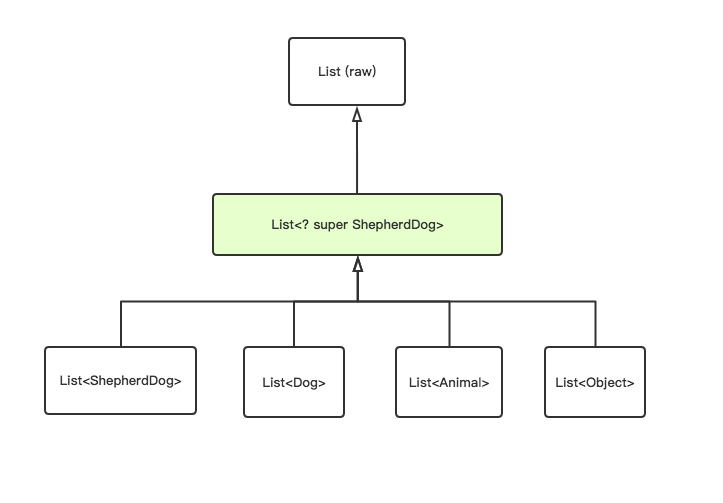
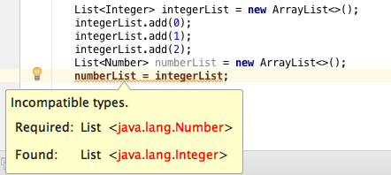
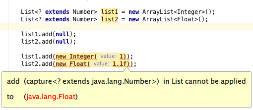

第6章 泛型 
====

## 6.1 泛型（Generic Type）简介

通常情况的类和函数，我们只需要使用具体的类型即可：要么是基本类型，要么是自定义的类。

但是尤其在集合类的场景下，我们需要编写可以应用于多种类型的代码，我们最简单原始的做法是，针对每一种类型，写一套刻板的代码。

这样做，代码复用率会很低，抽象也没有做好。

在 jdk 5 中，Java引入了泛型。泛型，即“参数化类型”（Parameterized Type）。顾名思义，就是将类型由原来的具体的类型参数化，类似于方法中的变量参数，此时类型也定义成参数形式，我们称之为类型参数，然后在使用时传入具体的类型（类型实参）。

我们知道，在数学中泛函是以函数为自变量的函数。类比的来理解，编程中的泛型就是以类型为变量的类型，即参数化类型。这样的变量参数就叫类型参数(Type Parameters)。

本章我们来一起学习一下Kotlin泛型的相关知识。

### 6.1.1 为什么要有类型参数

我们先来看下没有泛型之前，我们的集合类是怎样持有对象的。

在Java中，Object类是所有类的根类。为了集合类的通用性。我们把元素的类型定义为Object，当放入具体的类型的时候，再作强制类型转换。

这是一个示例代码：

```java
class RawArrayList {
    public int length = 0;
    private Object[] elements;

    public RawArrayList(int length) {
        this.length = length;
        this.elements = new Object[length];
    }

    public Object get(int index) {
        return elements[index];
    }

    public void add(int index, Object element) {
        elements[index] = element;
    }

    @Override
    public String toString() {
        return "RawArrayList{" +
            "length=" + length +
            ", elements=" + Arrays.toString(elements) +
            '}';
    }
}

```

一个简单的测试代码如下：
```java
public class RawTypeDemo {

    public static void main(String[] args) {
        RawArrayList rawArrayList = new RawArrayList(4);
        rawArrayList.add(0, "a");
        rawArrayList.add(1, "b");
        System.out.println(rawArrayList);

        String a = (String)rawArrayList.get(0);
        System.out.println(a);

        String b = (String)rawArrayList.get(1);
        System.out.println(b);

        rawArrayList.add(2, 200);
        rawArrayList.add(3, 300);
        System.out.println(rawArrayList);

        int c = (int)rawArrayList.get(2);
        int d = (int)rawArrayList.get(3);
        System.out.println(c);
        System.out.println(d);

        // Exception in thread "main" java.lang.ClassCastException: 
      	// java.lang.Integer cannot be cast to java.lang.String
        String x = (String)rawArrayList.get(2);
        System.out.println(x);
    }
}
```

我们可以看出，在使用原生态类型（raw type）实现的集合类中，我们使用的是Object[]数组。这种实现方式，存在的问题有两个：

1. 向集合中添加对象元素的时候，没有对元素的类型进行检查，也就是说，我们往集合中添加任意对象，编译器都不会报错。

2. 当我们从集合中获取一个值的时候，我们不能都使用Object类型，需要进行强制类型转换。而这个转换过程由于在添加元素的时候没有作任何的类型的限制跟检查，所以容易出错。例如上面代码中的：

```java
String a = (String)rawArrayList.get(0);
```
对于这行代码，编译时不会报错，但是运行时会抛出类型转换错误。

由于我们不能笼统地把集合类中所有的对象是视作Object，然后在使用的时候各自作强制类型转换。因此，我们引入了类型参数来解决这个类型安全使用的问题。

Java 中的泛型是在1.5 之后加入的，我们可以为类和方法分别定义泛型参数，比如说Java中的Map接口的定义：

```java
public interface Map<K,V> {
    ...
    boolean containsKey(Object key);
    boolean containsValue(Object value);
    V get(Object key);
    V put(K key, V value);
    V remove(Object key);
    void putAll(Map<? extends K, ? extends V> m);
    Set<K> keySet();
    Collection<V> values();
    Set<Map.Entry<K, V>> entrySet();
    default V getOrDefault(Object key, V defaultValue) {
        V v;
        return (((v = get(key)) != null) || containsKey(key))
            ? v
            : defaultValue;
    }
}
```

我们在Kotlin 中的写法基本一样：

```kotlin
public interface Map<K, out V> {
    ...
    public fun containsKey(key: K): Boolean
    public fun containsValue(value: @UnsafeVariance V): Boolean
    public operator fun get(key: K): V?
    @SinceKotlin("1.1")
    @PlatformDependent
    public fun getOrDefault(key: K, defaultValue: @UnsafeVariance V): V {
        // See default implementation in JDK sources
        return null as V
    }
    public val keys: Set<K>
    public val values: Collection<V>
    public val entries: Set<Map.Entry<K, V>>

}

public interface MutableMap<K, V> : Map<K, V> {
    public fun put(key: K, value: V): V?
    public fun remove(key: K): V?
    public fun putAll(from: Map<out K, V>): Unit
    ...
}
```

比如，在实例化一个Map时，我们使用这个函数：
```kotlin
fun <K, V> mapOf(vararg pairs: Pair<K, V>): Map<K, V>
```
类型参数K，V是一个占位符，当泛型类型被实例化和使用时，它将被一个实际的类型参数所替代。

代码示例

```kotlin
>>> val map = mutableMapOf<Int,String>(1 to "a", 2 to "b", 3 to "c")
>>> map
{1=a, 2=b, 3=c}
>>> map.put(4,"c")
null
>>> map
{1=a, 2=b, 3=c, 4=c}
```
mutableMapOf&lt;Int,String>表示参数化类型&lt;K , V>分别是Int 和 String，这是泛型类型集合的实例化，在这里，放置K， V 的位置被具体的Int 和 String 类型所替代。

泛型主要是用来限制集合类持有的对象类型，这样使得类型更加安全。当我们在一个集合类里面放入了错误类型的对象，编译器就会报错：
```kotlin
>>> map.put("5","e")
error: type mismatch: inferred type is String but Int was expected
map.put("5","e")
        ^
```
Kotlin中有类型推断的功能，有些类型参数可以直接省略不写。上面的mapOf后面的类型参数可以省掉不写：

```kotlin
>>> val map = mutableMapOf(1 to "a", 2 to "b", 3 to "c")
>>> map
{1=a, 2=b, 3=c}
```
Java 和 Kotlin 的泛型实现，都是采用了运行时类型擦除的方式。也就是说，在运行时，这些类型参数的信息将会被擦除。Java 和 Kotlin 的泛型对于语法的约束是在编译期。

## 6.2 型变（Variance）

### 6.2.1 Java的类型通配符

Java 泛型的通配符有两种形式。我们使用

- 子类型上界限定符` ? extends T ` 指定类型参数的上限（该类型必须是类型T或者它的子类型）
- 超类型下界限定符` ? super T` 指定类型参数的下限（该类型必须是类型T或者它的父类型）

我们称之为类型通配符(Type Wildcard)。默认的上界（如果没有声明）是 `Any?`，下界是Nothing。

代码示例：
```java
class Animal {

    public void act(List<? extends Animal> list) {
        for (Animal animal : list) {
            animal.eat();
        }
    }

    public void aboutShepherdDog(List<? super ShepherdDog> list) {
        System.out.println("About ShepherdDog");
    }

    public void eat() {
        System.out.println("Eating");
    }

}

class Dog extends Animal {}

class Cat extends Animal {}

class ShepherdDog extends Dog {}
```

我们在方法`act(List<? extends Animal> list)`中, 这个list可以传入以下类型的参数：

```java
List<Animal>
List<Dog>
List<ShepherdDog>
List<Cat>
```
测试代码：
```java
List<Animal> list3 = new ArrayList<>();
list3.add(new Dog());
list3.add(new Cat());
animal.act(list3);

List<Dog> list4 = new ArrayList<>();
list4.add(new Dog());
list4.add(new Dog());
animal.act(list4);

List<Cat> list5 = new ArrayList<>();
list5.add(new Cat());
list5.add(new Cat());
animal.act(list5);
```

为了更加简单明了说明这些类型的层次关系，我们图示如下：

对象层次类图：


集合类泛型层次类图：



也就是说，List&lt;Dog>并不是List&lt;Animal>的子类型，而是两种不存在父子关系的类型。

而`List<? extends Animal>`是`List<Animal>`，`List<Dog>`等的父类型，对于任何的` List<X>`这里的` X `只要是Animal的子类型，那么`List<? extends Animal>`就是` List<X>`的父类型。

使用通配符`List<? extends Animal>`的引用, 我们不可以往这个List中添加Animal类型以及其子类型的元素：
```java
List<? extends Animal> list1 = new ArrayList<>();

list1.add(new Dog());
list1.add(new Animal());
```
这样的写法，Java编译器是不允许的。


因为对于set方法，编译器无法知道具体的类型，所以会拒绝这个调用。但是，如果是get方法形式的调用，则是允许的：

```java
List<? extends Animal> list1 = new ArrayList<>();
List<Dog> list4 = new ArrayList<>();
list4.add(new Dog());
list4.add(new Dog());
animal.act(list4);
list1 = list4;
animal.act(list1);
```

我们这里把引用变量`List<? extends Animal> list1`直接赋值`List<Dog> list4`, 因为编译器知道可以把返回对象转换为一个Animal类型。


相应的，` ? super T`超类型限定符的变量类型`List<? super ShepherdDog>`的层次结构如下：



在Java中，还有一个无界通配符，即单独一个`?`。如`List<?>`，`?`可以代表任意类型，“任意”是未知类型。例如:
```java
Pair<?>
```

参数替换后的Pair类有如下方法:

```java
? getFirst()
void setFirst(?)
```

我们可以调用getFirst方法，因为编译器可以把返回值转换为Object。
但是不能调用setFirst方法，因为编译器无法确定参数类型。

通配符在类型系统中具有重要的意义，它们为一个泛型类所指定的类型集合提供了一个有用的类型范围。泛型参数表明的是在类、接口、方法的创建中，要使用一个数据类型参数来代表将来可能会用到的一种具体的数据类型。它可以是Integer类型，也可以是String类型。我们通常把它的类型定义成 E、T 、K 、V等等。

当我们在实例化对象的时候，必须声明T具体是一个什么类型。所以当我们把T定义成一个确定的泛型数据类型，参数就只能是这种数据类型。此时，我们就用到了通配符代替指定的泛型数据类型。

如果把一个对象分为声明、使用两部分的话。泛型主要是侧重于类型的声明的代码复用，通配符则侧重于使用上的代码复用。泛型用于定义内部数据类型的参数化，通配符则用于定义使用的对象类型的参数化。

使用泛型、通配符提高了代码的复用性。同时对象的类型得到了类型安全的检查，减少了类型转换过程中的错误。

### 6.2.2 协变（covariant）与逆变（contravariant）

在Java中数组是协变的，下面的代码是可以正确编译运行的：

```java
Integer[] ints = new Integer[3];
ints[0] = 0;
ints[1] = 1;
ints[2] = 2;
Number[] numbers = new Number[3];
numbers = ints;
for (Number n : numbers) {
    System.out.println(n);
}
```

在Java中，因为 Integer 是 Number 的子类型，数组类型 Integer[] 也是 Number[] 的子类型，因此在任何需要 Number[] 值的地方都可以提供一个 Integer[] 值。

而另一方面，泛型不是协变的。也就是说， List&lt;Integer> 不是 List&lt;Number> 的子类型，试图在要求 List&lt;Number> 的位置提供 List&lt;Integer> 是一个类型错误。下面的代码，编译器是会直接报错的：

```java
List<Integer> integerList = new ArrayList<>();
integerList.add(0);
integerList.add(1);
integerList.add(2);
List<Number> numberList = new ArrayList<>();
numberList = integerList;
```

编译器报错提示如下：



Java中泛型和数组的不同行为，的确引起了许多混乱。

就算我们使用通配符，这样写：

```java
List<? extends Number> list = new ArrayList<Number>();  
list.add(new Integer(1)); //error  
```
仍然是报错的：


为什么Number的对象可以由Integer实例化，而ArrayList&lt;Number>的对象却不能由ArrayList&lt;Integer>实例化？list中的<? extends Number>声明其元素是Number或Number的派生类，为什么不能add Integer?为了解决这些问题，需要了解Java中的逆变和协变以及泛型中通配符用法。

#### 逆变与协变

Animal类型（简记为F, Father）是Dog类型（简记为C, Child）的父类型，我们把这种父子类型关系简记为F <|  C。

而List&lt;Animal>, List&lt;Dog>的类型，我们分别简记为f(F), f(C)。

那么我们可以这么来描述协变和逆变：

>当F <| C 时, 如果有f(F) <| f(C),那么f叫做协变（Convariant）；
>当F <| C 时, 如果有f(C) <| f(F),那么f叫做逆变（Contravariance）。
>如果上面两种关系都不成立则叫做不可变。

协变和逆协变都是类型安全的。

Java中泛型是不变的，可有时需要实现逆变与协变，怎么办呢？这时就需要使用我们上面讲的通配符`?` 。

#### `<? extends T>`实现了泛型的协变

```java
List<? extends Number> list = new ArrayList<>();  
```

这里的`? extends Number`表示的是Number类或其子类，我们简记为C。

这里`C <| Number`，这个关系成立：`List<C>  <|  List< Number >`。即有：

```java
List<? extends Number> list1 = new ArrayList<Integer>();  
List<? extends Number> list2 = new ArrayList<Float>();  
```
但是这里不能向list1、list2添加除null以外的任意对象。

```java
list1.add(null);
list2.add(null);

list1.add(new Integer(1)); // error
list2.add(new Float(1.1f)); // error
```

因为，List&lt;Integer>可以添加Interger及其子类，List&lt;Float>可以添加Float及其子类，List&lt;Integer>、List&lt;Float>都是`List<? extends Number>`的子类型，如果能将Float的子类添加到`List<? extends Number>`中，那么也能将Integer的子类添加到`List<? extends Number>`中, 那么这时候`List<? extends Number>`里面将会持有各种Number子类型的对象（Byte，Integer，Float，Double等等）。Java为了保护其类型一致，禁止向List<? extends Number>添加任意对象，不过可以添加null。



#### `<? super T>`实现了泛型的逆变
```java
List<? super Number> list = new ArrayList<>();  
```

`? super Number` 通配符则表示的类型下界为Number。即这里的父类型F是`? super Number`, 子类型C是Number。即当F <| C , 有f(C) <| f(F) ， 这就是逆变。代码示例：

```java
List<? super Number> list3 = new ArrayList<Number>();  
List<? super Number> list4 = new ArrayList<Object>();  
list3.add(new Integer(3));  
list4.add(new Integer(4));  
```

也就是说，我们不能往`List<? super Number >`中添加Number的任意父类对象。但是可以向List<? super Number >添加Number及其子类对象。

#### PECS

现在问题来了：我们什么时候用extends什么时候用super呢？《Effective Java》给出了答案：

>PECS: producer-extends, consumer-super

比如，一个简单的Stack API：
```java
public class Stack<E>{  
    public Stack();  
    public void push(E e):  
    public E pop();  
    public boolean isEmpty();  
}  
```

要实现pushAll(Iterable&lt;E> src)方法，将src的元素逐一入栈：
```java
public void pushAll(Iterable<E> src){  
    for(E e : src)  
        push(e)  
}  
```

假设有一个实例化Stack&lt;Number>的对象stack，src有Iterable&lt;Integer>与 Iterable&lt;Float>；

在调用pushAll方法时会发生type mismatch错误，因为Java中泛型是不可变的，Iterable&lt;Integer>与 Iterable&lt;Float>都不是Iterable&lt;Number>的子类型。

因此，应改为

```java
// Wildcard type for parameter that serves as an E producer  
public void pushAll(Iterable<? extends E> src) {  
    for (E e : src)   // out T, 从src中读取数据，producer-extends
        push(e);  
}  
```

要实现popAll(Collection&lt;E> dst)方法，将Stack中的元素依次取出add到dst中，如果不用通配符实现：

```java
// popAll method without wildcard type - deficient!  
public void popAll(Collection<E> dst) {  
    while (!isEmpty())  
        dst.add(pop());    
}  
```

同样地，假设有一个实例化Stack&lt;Number>的对象stack，dst为Collection&lt;Object>；

调用popAll方法是会发生type mismatch错误，因为Collection&lt;Object>不是Collection&lt;Number>的子类型。

因而，应改为：

```java
// Wildcard type for parameter that serves as an E consumer  
public void popAll(Collection<? super E> dst) {  
    while (!isEmpty())  
        dst.add(pop());   // in T, 向dst中写入数据， consumer-super
}  
```

Naftalin与Wadler将PECS称为 **Get and Put Principle**。

在`java.util.Collections`的`copy`方法中(JDK1.7)完美地诠释了PECS：

```java
public static <T> void copy(List<? super T> dest, List<? extends T> src) {  
    int srcSize = src.size();  
    if (srcSize > dest.size())  
        throw new IndexOutOfBoundsException("Source does not fit in dest");  
  
    if (srcSize < COPY_THRESHOLD ||  
        (src instanceof RandomAccess && dest instanceof RandomAccess)) {  
        for (int i=0; i<srcSize; i++)  
            dest.set(i, src.get(i));  
    } else {  
        ListIterator<? super T> di=dest.listIterator();   // in T, 写入dest数据
        ListIterator<? extends T> si=src.listIterator();   // out T， 读取src数据
        for (int i=0; i<srcSize; i++) {  
            di.next();  
            di.set(si.next());  
        }  
    }  
}  
```

## 6.3 Kotlin的泛型特色

正如上文所讲的，在 Java 泛型里，有通配符这种东西，我们要用` ? extends T `指定类型参数的上限，用 `? super T `指定类型参数的下限。

而Kotlin 抛弃了这个东西，引用了生产者和消费者的概念。也就是我们前面讲到的PECS。生产者就是我们去读取数据的对象，消费者则是我们要写入数据的对象。这两个概念理解起来有点绕。

我们用代码示例简单讲解一下：

```java
public static <T> void copy(List<? super T> dest, List<? extends T> src) {  
        ...
        ListIterator<? super T> di = dest.listIterator();   // in T, 写入dest数据
        ListIterator<? extends T> si = src.listIterator();   // out T， 读取src数据
         ...
}  
```

`List<? super T> dest`是消费数据的对象，这些数据会写入到该对象中，这些数据该对象被“吃掉”了（Kotlin中叫`in T`）。

`List<? extends T> src`是生产提供数据的对象。这些数据哪里来的呢？就是通过src读取获得的（Kotlin中叫`out T`）。

### 6.3.1 `out T` 与` in T`

在Kotlin中，我们把那些只能保证读取数据时类型安全的对象叫做生产者，用 `out T `标记；把那些只能保证写入数据安全时类型安全的对象叫做消费者，用 `in T `标记。

如果你觉得太晦涩难懂，就这么记吧：

>`out T` 等价于` ? extends T`
>`in T` 等价于 `? super T`
>此外, 还有 `*` 等价于` ?`

### 6.3.2 声明处型变

Kotlin 泛型中添加了声明处型变。看下面的例子：

```kotlin
interface Source<out T> {
    fun <T> nextT();
}
```

我们在接口的声明处用 `out T ` 做了生产者声明以实现安全的类型协变：

```kotlin
fun demo(str: Source<String>) {
    val obj: Source<Any> = str // 合法的类型协变
}
```

Kotlin 中有大量的声明处协变，比如 Iterable 接口的声明：

```kotlin
public interface Iterable<out T> {
    public operator fun iterator(): Iterator<T>
}
```

因为 Collection 接口和 Map 接口都继承了 Iterable 接口，而 Iterable 接口被声明为生产者接口，所以所有的 Collection 和 Map 对象都可以实现安全的类型协变：
```kotlin
val c: List<Number> = listOf(1, 2, 3)
```

这里的 listOf() 函数返回 `List<Int> `类型，因为 List 接口实现了安全的类型协变，所以可以安全地把 `List<Int> `类型赋给 `List<Number>` 类型变量。

### 6.3.3 类型投影

将类型参数 T 声明为 out 非常方便，并且能避免使用处子类型化的麻烦，但是有些类实际上**不能**限制为只返回 `T`。

一个很好的例子是 Array：

```kotlin
class Array<T>(val size: Int) {
    fun get(index: Int): T {  }
    fun set(index: Int, value: T) {  }
}
```

该类在 `T` 上既不能是协变的也不能是逆变的。这造成了一些不灵活性。考虑下述函数：

```kotlin
fun copy(from: Array<Any>, to: Array<Any>) {
    assert(from.size == to.size)
    for (i in from.indices)
        to[i] = from[i]
}
```

这个函数应该将项目从一个数组复制到另一个数组。如果我们采用如下方式使用这个函数：

```kotlin
val ints: Array<Int> = arrayOf(1, 2, 3)
val any = Array<Any>(3) { "" } 
copy(ints, any) // 错误：期望 (Array<Any>, Array<Any>)
```

这里我们将遇到同样的问题：`Array <T>` 在 `T` 上是**不型变的**，因此 `Array <Int>` 和 `Array <Any>` 都不是另一个的子类型。

那么，我们唯一要确保的是 `copy()` 不会做任何坏事。我们阻止它写到 `from`，我们可以：

```kotlin
fun copy(from: Array<out Any>, to: Array<Any>) {}
```

现在这个`from`是一个受`Array<out Any>`限制的（**投影的**）数组。在Kotlin中，称为**类型投影**(type projection)。其主要作用是参数作限定，避免不安全操作。

类似的，我们也可以使用 **in** 投影一个类型：

```kotlin
fun fill(dest: Array<in String>, value: String) {}
```

`Array<in String>` 对应于 Java 的 `Array<? super String>`，也就是说，我们可以传递一个 `CharSequence` 数组或一个 `Object` 数组给 `fill()` 函数。

类似Java中的无界类型通配符`?`,  Kotlin 也有对应的**星投影**语法`*`。

例如，如果类型被声明为 `interface Function <in T, out U>`，我们有以下星投影：

 - `Function<*, String>` 表示 `Function<in Nothing, String>`；
 - `Function<Int, *>` 表示 `Function<Int, out Any?>`；
 - `Function<*, *>` 表示 `Function<in Nothing, out Any?>`。

`*`投影跟 Java 的原始类型类似，不过是安全的。

## 6.6 泛型类

声明一个泛型类
```kotlin
class Box<T>(t: T) {
    var value = t
}
```
通常, 要创建这样一个类的实例, 我们需要指定类型参数:
```kotlin
val box: Box<Int> = Box<Int>(1)
```
但是, 如果类型参数可以通过推断得到, 比如, 通过构造器参数类型, 或通过其他手段推断得到, 此时允许省略类型参数:
```kotlin
val box = Box(1) // 1 的类型为 Int, 因此编译器知道我们创建的实例是 Box<Int> 类型
```

## 6.5 泛型函数

类可以有类型参数。函数也有。类型参数要放在函数名称之前：

```kotlin
fun <T> singletonList(item: T): List<T> {}
fun <T> T.basicToString() : String {  // 扩展函数
}
```

要调用泛型函数，在函数名后指定类型参数即可：

```kotlin
val l = singletonList<Int>(1)
```
泛型函数与其所在的类是否是泛型没有关系。泛型函数独立于其所在的类。我们应该尽量使用泛型方法，也就是说如果使用泛型方法可以取代将整个类泛型化，那么就应该只使用泛型方法，因为它可以使事情更明白。

## 本章小结

泛型是一个非常有用的东西。尤其在集合类中。我们可以发现大量的泛型代码。

本章我们通过对Java泛型的回顾，对比介绍了Kotlin泛型的特色功能，尤其是协变、逆变、`in`、 `out`等概念，需要我们深入去理解。只有深入理解了这些概念，我们才能更好理解并用好Kotlin的集合类，进而写出高质量的泛型代码。

泛型实现是依赖OOP中的类型多态机制的。Kotlin是一门支持面向对象编程（OOP）跟函数式编程（FP）强大的语言。我们已经学习了Kotlin的语言基础知识、类型系统、集合类、泛型等相关知识了，相信您已经对Kotlin有了一个初步的了解。

在下一章节中，我们将一起来学习Kotlin的面向对象编程相关的知识。